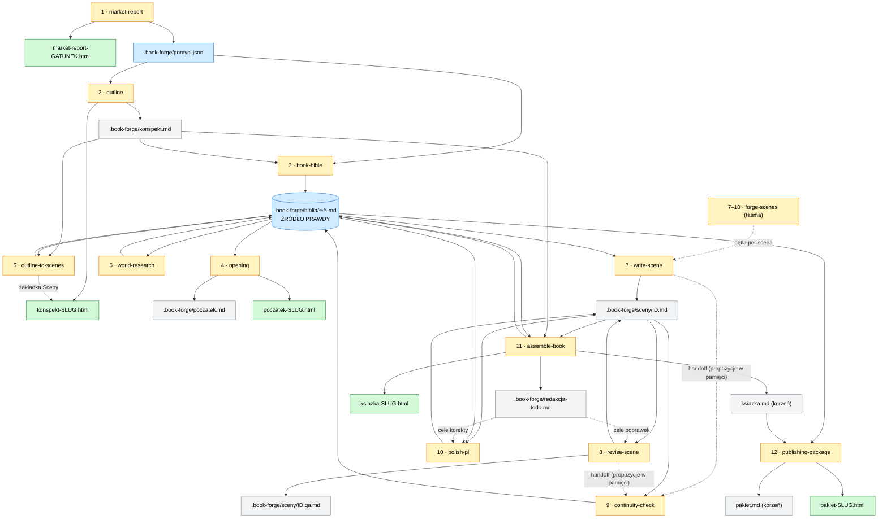

# book-forge

Pipeline do tworzenia powieści napędzany **rojem agentów** (narzędzie Workflow). Prowadzi autora od pomysłu do gotowego maszynopisu, etap po etapie. Każdy etap kończy **obowiązkowa redakcja na poprawną, naturalną polszczyznę** (skill `/unslop:unslop` + słownik anty-anglicyzmowy), a od momentu pisania prozy wszystko opiera się na wspólnym fundamencie — **biblii książki**.

> Dwa równorzędne kryteria jakości: **naturalna polszczyzna** (bez AI-slopu i polsko-angielskich potworków) oraz **spójność** — świat, postacie, nazwy i fakty mają „trzymać się kupy” od pierwszej do ostatniej strony.

## Polecenia

Status: ✅ gotowe · 🔜 planowane (mapa: `shared/roadmap.md`).

| # | Polecenie | Status | Co robi |
| --- | --- | --- | --- |
| 1 | `/book-forge:market-report` | ✅ | Interaktywny raport HTML: 10 bestsellerów niszy, 3 luki rynkowe, 5 pomysłów (z **silnikiem premisy**, generowanych przez soczewki twórcze), ocena 1–10 z **adwokatem innowacji**, wybór zwycięzcy. |
| 1L | `/book-forge:idea-spark` | ✅ | **Autorski wariant etapu 1** (bez badania rynku): autor w szczegółowym kwestionariuszu ustala **trzon** (kierunek, bohaterowie, świat), a rój generuje **5 wariantów fabuły** w jego ramach (z **silnikiem premisy** i soczewkami twórczymi), ocenia rzemieślniczo z **adwokatem innowacji** (bez WebSearch) i wybiera zwycięzcę. `idea-spark-<gatunek>.html` (trzon + 5 fabuł + werdykt) + `.book-forge/pomysl.json`. |
| 2 | `/book-forge:outline` | ✅ | Konspekt rozdział po rozdziale (`.book-forge/konspekt.md` + interaktywny HTML) na bazie zwycięskiego pomysłu; każdy rozdział z **subwersją** standardowego beatu i **kotwicą** emocjonalną, struktura wybierana z realną wagą oryginalności. |
| 3 | `/book-forge:book-bible` | ✅ | Biblia książki: jedno źródło prawdy (świat, postacie z **profilem chaosu**, głosy, glosariusz z odmianą, kanon, fakty). Zdekomponowany kanon-wiki `.book-forge/biblia/**/*.md` + `.book-forge/biblia/index.md`. |
| 4 | `/book-forge:opening` | ✅ | Mocny początek: 3 warianty pierwszej sceny w głosie z biblii, ocena fabularna, kontrola ciągłości, werdykt. `poczatek-<slug>.html` + `.book-forge/poczatek.md`. |
| 5 | `/book-forge:outline-to-scenes` | ✅ | Konspekt → siatka scen (cel→konflikt→zwrot, wartość +/–), beaty, oś czasu, rejestr zasiewów. Zapisuje do biblii; siatka scen scalona do `konspekt-<slug>.html` jako zakładka „Sceny” (bez osobnego pliku). |
| 6 | `/book-forge:world-research` | ✅ | Weryfikacja realiów przez agent-browser/WebSearch (na żądanie z luk scen), adwersaryjna weryfikacja faktów, zapis do kanonu z cytowaniem (fakty + rejestr źródeł). Bez osobnych plików — wynik żyje w biblii. |
| 7 | `/book-forge:write-scene` | ✅ | Proza jednej sceny, sekwencyjnie, w głosie z biblii; preflight `bible.py check-stage`, wyciąg anty-amnezji ze streszczeń w kanonie; po napisaniu robi handoff do `continuity-check` (propozycje w pamięci → zapis do biblii). `.book-forge/sceny/<id>.md`. Bez unslopa (ten przychodzi w `polish-pl`). |
| 7–10T | `/book-forge:forge-scenes` | ✅ | **Tryb taśmowy pętli scen**: pytania RAZ na początku (zakres, długość, limit rewizji), potem sekwencyjnie `write-scene` → `revise-scene` → `continuity-check` → `polish-pl` dla N kolejnych scen; twardy stop tylko na konflikcie RO / wyczerpanym limicie. Postęp po każdej scenie z `bible.py status`. |
| 8 | `/book-forge:revise-scene` | ✅ | Pętla pogłębienie prozą → dev-edit „na ślepo” (PASS/FIX), z limitem prób i `accept-with-debt`, a po PASS faza **Disruption** (anty-przewidywalność: nieistotna myśl z chaosu postaci, złamana kontrola emocji, celowa szorstkość — chroniona przez `celowe_odstepstwa`). Poprawiona `.book-forge/sceny/<id>.md` + notatka QA. |
| 9 | `/book-forge:continuity-check` | ✅ | Bramka spójności i jedyny etap **prozy** zapisujący do kanonu: audyt vs biblia, RO → CONFLICT (blokada), RUNTIME → write-back + **streszczenie sceny** do agregatu `streszczenia` (wyciąg anty-amnezji). Aktualizacja biblii (kanon + `log_ciaglosci`); bez plików raportu. |
| 10 | `/book-forge:polish-pl` | ✅ | Finalna polszczyzna: unslop NAJPIERW (zakotwiczony stylem), potem korekta polonistyczna + walidacja nazw z glosariusza. Wygładzona `.book-forge/sceny/<id>.md` + `.book-forge/korekta-<id>.md`. |
| 11 | `/book-forge:assemble-book` | ✅ | Złożenie scen w rozdziały i całą książkę + przeglądy całości (łuk fabularny i postaci, wypłata zasiewów, tempo, motyw, oś czasu); metryki polskiego rynku (znaki, **arkusze wydawnicze** vs norma subgatunku), detektor powtórzeń `echo.py` i work-lista `.book-forge/redakcja-todo.md`; zamrożenie kanonu working→published. `ksiazka.md` (ze stroną tytułową) + interaktywny HTML. |
| 12 | `/book-forge:publishing-package` | ✅ | Pakiet wydawniczy: logline, elevator pitch, opis z okładki (bez spoilerów), synopsis (z zakończeniem), list do agenta, comp titles „dla czytelników X i Y”. `pakiet.md` + interaktywny HTML. |

**Pipeline jest kompletny** — od pomysłu (etap 1) po gotowy maszynopis i materiały do wysyłki (etap 12). Etap 1 ma dwa warianty: `market-report` (rynek podsuwa pomysł — z badaniem rynku) i `idea-spark` (autor sam projektuje trzon, a rój wariantuje fabułę — bez researchu); oba produkują `.book-forge/pomysl.json`, więc dalsze etapy działają tak samo niezależnie od wyboru. Pętlę scen (etapy 7–10) można prowadzić ręcznie albo taśmowo przez `forge-scenes` (pytania raz, stop tylko na decyzjach autora). Stan projektu w każdej chwili: `python3 scripts/bible.py status` (sceny wg statusu, słowa vs budżet, otwarte zasiewy); kontrakt wejścia etapu przed drogim rojem: `bible.py check-stage <etap>`.

## Układ katalogu książki

Pełna mapa plików generowanych przez pipeline, etap po etapie. Trzy typy artefaktów:

- **🟢 dla człowieka** — prezentacyjny HTML do oglądania (+ finalny maszynopis),
- **🔵 dane / most** — deterministyczne JSON/biblia, czytane przez kolejne etapy,
- **⚪ proza / robocze** — pliki `.md` z tekstem i notatkami.

W katalogu, w którym powstaje książka, **w korzeniu zostaje tylko to, co dla człowieka** — prezentacyjne `*.html` oraz finalny maszynopis `ksiazka.md` i `pakiet.md`. Cała mechanika robocza chowa się do ukrytego **`.book-forge/`** (`.book-forge/biblia/` to kanon):

```
mojaksiazka/
├─ market-report-<gatunek>.html   🟢 raporty / widoki
├─ konspekt-<slug>.html
├─ poczatek-<slug>.html
├─ ksiazka-<slug>.html
├─ pakiet-<slug>.html
├─ ksiazka.md                     ⚪ finalny maszynopis (zostaje w korzeniu)
├─ pakiet.md                      ⚪ finalny pakiet wydawniczy
└─ .book-forge/                   🔵⚪ wszystko robocze (ukryte)
   ├─ pomysl.json
   ├─ konspekt.md  poczatek.md
   ├─ korekta-<id>.md
   ├─ redakcja-todo.md            work-lista z przeglądu całości (regenerowana)
   ├─ seria.md                    (tylko tryb serii)
   ├─ biblia/**/*.md              kanon — źródło prawdy
   └─ sceny/<id>.md  <id>.qa.md
```

Sterują tym trzy zmienne (helpery `bible.book_path()` / `bible.work_path()`): `BOOK_DIR`
(korzeń = `""`), `WORK` (`.book-forge/`), `BIBLE_DIR` (`.book-forge/biblia`). Tryb serii zagnieżdża
je pod tomem: `BOOK_DIR=tom-NN/`, `WORK=tom-NN/.book-forge/`, `BIBLE_DIR=tom-NN/.book-forge/biblia`
(a `.book-forge/seria.md` zostaje jeden, ponad tomami).

### Tabela artefaktów

| Etap | Skill | Artefakt | Typ | Rola |
|------|-------|----------|-----|------|
| 1 | `market-report` | `market-report-<gatunek>.html` | 🟢 | Raport rynkowy do oglądania |
| 1 | `market-report` | `.book-forge/pomysl.json` | 🔵 | Deterministyczny most → etapy 2–3 (zwycięski pomysł, brief, verdict, genre, reader) |
| 1L | `idea-spark` | `idea-spark-<gatunek>.html` | 🟢 | Raport do oglądania (3 zakładki: trzon wizji + 5 fabuł + werdykt) |
| 1L | `idea-spark` | `.book-forge/pomysl.json` | 🔵 | Ten sam most → etapy 2–3 co `market-report` (wariant bez badania rynku, bez pola `gap`) |
| 2 | `outline` | `.book-forge/konspekt.md` | ⚪ | Konspekt rozdział po rozdziale (źródło dla dalszych etapów) |
| 2 | `outline` | `konspekt-<slug>.html` | 🟢 | Interaktywny konspekt dla autora |
| 3 | `book-bible` | `.book-forge/biblia/**/*.md` | 🔵 | Kanon-wiki — **źródło prawdy** (świat, postacie, głosy, glosariusz, kanon fabularny) |
| 3 | `book-bible` | `.book-forge/biblia/index.md` | 🔵 | Katalog / spis treści biblii |
| 4 | `opening` | `.book-forge/poczatek.md` | ⚪ | Proza pierwszej sceny |
| 4 | `opening` | `poczatek-<slug>.html` | 🟢 | Prezentacja otwarcia + warianty |
| 5 | `outline-to-scenes` | *(wpis do `.book-forge/biblia/`)* | 🔵 | Siatka scen, oś czasu, rejestr zasiewów — **brak osobnego pliku** |
| 5 | `outline-to-scenes` | zakładka „Sceny" w `konspekt-<slug>.html` | 🟢 | Scalone do istniejącego HTML konspektu |
| 6 | `world-research` | *(wpis do `.book-forge/biblia/`)* | 🔵 | Fakty + źródła — **świadomie brak** osobnego pliku |
| 7 | `write-scene` | `.book-forge/sceny/<id>.md` | ⚪ | Proza pojedynczej sceny; po napisaniu **handoff do continuity-check** (propozycje w pamięci, bez pliku) |
| 8 | `revise-scene` | `.book-forge/sceny/<id>.md` (nadpisana) | ⚪ | Pogłębiona / zredagowana scena |
| 8 | `revise-scene` | `.book-forge/sceny/<id>.qa.md` | ⚪ | Notatka QA (werdykt, oceny, dziennik rund, dług) |
| 9 | `continuity-check` | *(zapis RUNTIME do `.book-forge/biblia/` + `log_ciaglosci` + streszczenie sceny do `streszczenia`)* | 🔵 | **Jedyny etap prozy z prawem zapisu** do kanonu — **bez plików raportu** (podsumowanie tylko w czacie) |
| 10 | `polish-pl` | `.book-forge/sceny/<id>.md` (wygładzona) | ⚪ | Finalna polszczyzna |
| 10 | `polish-pl` | `.book-forge/korekta-<id>.md` | ⚪ | Raport zmian językowych |
| 11 | `assemble-book` | `ksiazka.md` | ⚪ | Cała książka (strona tytułowa z metrykami: słowa, znaki, arkusze wydawnicze; rozdziały + sceny, deterministyczne złożenie) — **w korzeniu** |
| 11 | `assemble-book` | `ksiazka-<slug>.html` | 🟢 | Interaktywny przegląd całości |
| 11 | `assemble-book` | `.book-forge/redakcja-todo.md` | ⚪ | Work-lista redakcyjna (problemy przeglądu całości + echa z `echo.py` per scena) — **regenerowana w całości** przy każdym przebiegu; czytają ją `revise-scene`/`polish-pl` |
| 11 | `assemble-book` | *(aktualizacja `.book-forge/biblia/`, freeze `working`→`published`)* | 🔵 | Finalne statusy zasiewów / łuków, zamrożenie kanonu |
| 12 | `publishing-package` | `pakiet.md` | ⚪ | Logline, blurb, synopsis, list do agenta, comps — **w korzeniu** |
| 12 | `publishing-package` | `pakiet-<slug>.html` | 🟢 | Interaktywny pakiet wydawniczy |
| 12 | `publishing-package` | `pakiet-en.md` *(opcjonalnie)* | ⚪ | Równoległa wersja EN dla rynku zagranicznego |

### Wzorce

- **Para „dane + prezentacja"** powtarza się świadomie: ciężkie etapy produkują równolegle deterministyczny artefakt maszynowy (`.book-forge/pomysl.json`, `.book-forge/biblia/`) **i** ładny HTML dla człowieka. Kolejne etapy zawsze czytają wersję danych, HTML traktują jako fallback.
- **`.book-forge/biblia/` to centralny hub** — etapy 5, 6, 9, 11 piszą do niej zamiast tworzyć osobne pliki. Dlatego `outline-to-scenes` i `world-research` **nie generują** własnych artefaktów (siatka scen ląduje w biblii, a research celowo nie ma osobnego pliku).
- **HTML jest samodzielny** — dane wstrzykiwane inline (`const DATA = {...}`), zero ścieżek względnych do plików roboczych. Dlatego HTML może leżeć w korzeniu, podczas gdy reszta jest w `.book-forge/`, bez psucia widoków.
- **`<slug>` / `<id>`** w nazwach pozwala trzymać wiele książek / scen obok siebie.
- **`.book-forge/seria.md`** to plik *wejściowy* trybu serii (czytany przez `bible.read_series()`), nie artefakt generowany — sterownik dziedziczenia kanonu między tomami.

### Przepływ artefaktów przez pipeline

Węzły 🔵/⚪ (poza `ksiazka.md`/`pakiet.md`) mieszkają w `.book-forge/`; 🟢 i finalny maszynopis — w korzeniu.



**Legenda diagramu:** 🟡 żółte węzły = etapy (skille), 🟢 zielone = HTML dla człowieka, 🔵 niebieskie = dane / most, ⚪ szare = proza / robocze. Strzałka do/z `.book-forge/biblia/` oznacza odczyt/zapis kanonu; strzałka przerywana = scalenie do istniejącego pliku.

## Mechanizm biblii (fundament spójności)

Od etapu pisania całość stoi na **biblii książki** — usystematyzowanym, wspólnym stanie projektu, który każdy etap czyta, dzięki czemu agent zawsze ma pełny kontekst. Pełna specyfikacja: **`shared/biblia-spec.md`**. Najważniejsze:

- Zdekomponowany kanon-wiki: drzewo `.book-forge/biblia/**/*.md` (jedna encja = jeden plik; strony frontmatter-only — JSON to prawda, edytor renderuje go jako tabelę; pełną treść markdown mają tylko `.book-forge/biblia/index.md` (katalog) i `.book-forge/biblia/log.md` (kronika)). Całe I/O przez `scripts/bible.py`; `bible.load_all()` skleja to w obiekt o kształcie dawnego kanonu, więc skille czytające zmieniają tylko źródło wczytania.
- Pola RO (ustalenia: POV, czas, opis postaci, łuki, zasady świata, nazwy) vs RUNTIME (stan bieżący). Etapy pisania tylko czytają i proponują; zapis do kanonu idzie wyłącznie przez bramkę kontroli ciągłości — to chroni przed kanonizacją błędu.
- Glosariusz z pełną polską odmianą nazw i listą wariantów zakazanych (ochrona przed dryfem i „poprawkami” unslopa).

## Reguły języka (wspólne)

`shared/polish-style.md` — słownik kalk i anglicyzmów, kalki składniowe, fałszywi przyjaciele, lokalizacja tytułów, typografia. Wspólne dla wszystkich poleceń (odwołanie `${CLAUDE_PLUGIN_ROOT}/shared/polish-style.md`).

## Wymagania

- Narzędzie **Workflow** (rój agentów); bez niego skille mają zapasowe wywołanie równoległych agentów `Task`.
- Skill **`/unslop:unslop`** — obowiązkowy przebieg redakcji.
- CLI **agent-browser** (`npm i -g agent-browser && agent-browser install`) — research i weryfikacja (np. polskich wydań tytułów).
- **Node.js** + **Python 3** (tylko biblioteka standardowa — bez pyyaml) — walidacja artefaktów (`node --check` na HTML, `python3 scripts/bible.py validate` na kanonie-wiki).

## Struktura

```
book-forge/
  .claude-plugin/plugin.json
  shared/
    polish-style.md        # reguły języka (wspólne)
    biblia-spec.md         # specyfikacja biblii książki (wspólny stan)
    roadmap.md             # mapa etapów pipeline'u
  scripts/
    bible.py               # biblioteka kanonu-wiki (jedyne I/O do .book-forge/biblia/; load_all, write_entity, append_record, update_meta, validate, check-stage, status…)
    echo.py                # detektor powtórzeń frazowych (n-gramy, słowa-ulubieńcy, otwarcia akapitów) — zasila redakcja-todo
    tests/                 # fixture + testy E2E (python3 scripts/tests/test_bible.py, test_echo.py)
  skills/market-report/    # etap 1  (SKILL + szablon + workflow + build-and-verify)
  skills/idea-spark/       # etap 1  (wariant autorski: trzon → 5 wariantów fabuły, bez badania rynku)
  skills/outline/          # etap 2
  skills/book-bible/       # fundament: biblia
  skills/opening/          # etap pisania: mocny początek
  skills/outline-to-scenes/ # most: konspekt → siatka scen
  skills/world-research/   # research realiów do kanonu (z cytowaniem)
  skills/write-scene/      # proza: pojedyncza scena (sekwencyjnie)
  skills/forge-scenes/     # tryb taśmowy pętli 7-10 (orkiestrator bez własnego roju)
  skills/revise-scene/     # pogłębienie + dev-edit (pętla generuj→oceń)
  skills/continuity-check/ # bramka kanonu (jedyny zapis do biblii)
  skills/polish-pl/        # finalna polszczyzna (unslop → korekta PL)
  skills/assemble-book/    # złożenie + przeglądy całości (working→published)
  skills/publishing-package/ # pakiet wydawniczy (logline, synopsis, list do agenta)
```

Każdy skill ma `SKILL.md`, `references/workflow-swarm.md`, `references/build-and-verify.md`; etapy z wynikiem wizualnym mają też `assets/*-template.html`.

## Instalacja (lokalnie do testów)

```bash
# z korzenia repozytorium (ścieżkę dostosuj do swojego środowiska):
claude --plugin-dir config/plugins/dev-marketplace/book-forge
```

Albo przez marketplace `dev-marketplace` (wpis w `.claude-plugin/marketplace.json`).
